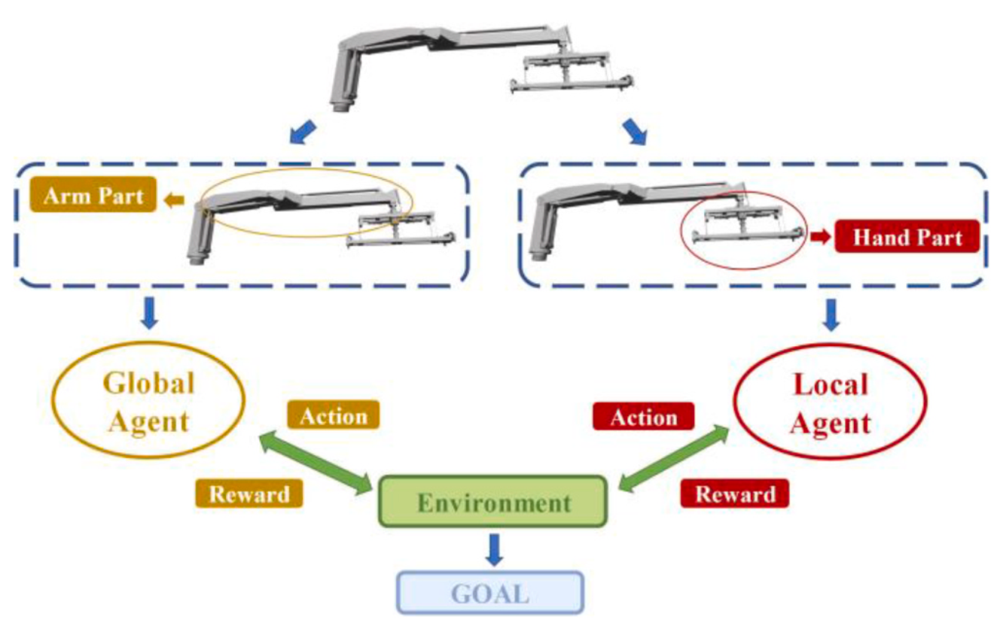
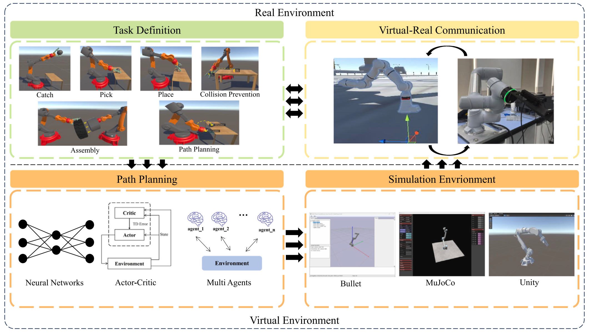
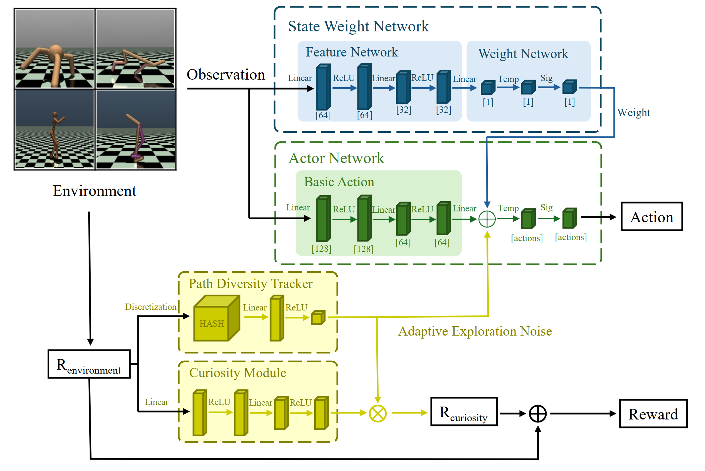

  

    <h1 style="margin-bottom: 10px; text-align: center;">Yichen Wang</h1>
     
    

      I am a <b>Ph.D. student</b> in Software Engineering at <b>Xi'an Jiaotong University</b>, advised by Prof. Shuai Zheng. 
      My research focuses on <b>Digital Twin</b>, <b>Robotic Manipulation</b> and <b>Reinforcement Learning</b>.
    

    

      I am currently focused on building Unity-based digital twin system development, embodied intelligence simulation environments and tackling reinforcement learning training challenges for robotic arms in complex tasks.
    

    

      <a href="https://scholar.google.cz/citations?user=ZefM-rAAAAAJ&hl=zh-CN">Google Scholar</a> | <a href="https://github.com/WiCC221">GitHub</a> | <a href="echenwang@stu.xjtu.edu.cn">Email</a>
    

  

  

    
    

<h2 style="display: flex; align-items: center;">🔥 News</h2>
<ul style="list-style: none; padding-left: 0;">
  <li style="margin-bottom: 10px;"><b>2026-02:</b> 🎉 Our paper was accepted by <b>Applied Soft Computing</b> (IF=6.6) !</li>
  <li style="margin-bottom: 10px;"><b>2025-11:</b> 🎉 Our paper was accepted by <b>Engineering Applications of Artificial Intelligence</b> (IF=8.0) !</li>
  <li style="margin-bottom: 10px;"><b>2025-09:</b> 🎉 Our paper was accepted by <b>Robotics and Computer-Integrated Manufacturing</b> (IF=11.4) !</li>
</ul>

<h2>📚 Publications</h2>

  

    
  

  

    <h4 style="margin: 0; color: #0366d6;">A global and local agent-based curriculum reinforcement learning approach for multi-end-effector robotic arm manipulation</h4>
    
<b>Yichen Wang</b>, Shuai Zheng*, Ze Yang, Jingmin Guo, Zitong Yang, Jun Hong

    
Engineering Applications of Artificial Intelligence

    
We propose a multi-agent reinforcement learning approach for hoisting tasks manipulated by robotic arm with multi-end-effectors. The method decomposes the robotic arm into global and local agents based on the degrees of freedom, with one agent controlling global and rough movement, and the other controlling local and fine movement. In this way, the multi-end-effectors’ spatial trajectory can be accurately manipulated. Moreover, in the training process, a four levels curriculum learning strategy is introduced, in which different reward functions are designed respectively, to make the training efficiency and effectiveness.

    <!-- 

      [<a href="#">Arxiv</a>] [<a href="#">Code</a>] [<a href="#">Video</a>] 
      Oral
    
 -->
  

  

    
  

  

    <h4 style="margin: 0; color: #0366d6;">Digital twin-empowered robotic arm manipulation with reinforcement learning A comprehensive survey</h4>
    
<b>Yichen Wang</b>, Shuai Zheng*, Ze Yang, Yingnan Zhu, Sen Zhang, Jiewu Leng, Jun Hong

    
Robotics and Computer-Integrated Manufacturing

    
This paper discusses the state-of-the-art of robotic arm intelligent manipulation related techniques empowered by DT and illustrates the picture for its future development. More specifically, it provides a novel perspective to analyze the entire workflow of DT-empowered robotic arm intelligent manipulation techniques, from task definition to path planning, simulation environment, and virtual-real communications, respectively.

  

  

    
  

  

    <h4 style="margin: 0; color: #0366d6;">A Novel Multi-Agent Reinforcement Learning Approach based on State Adaptive Weighting and Exploration Path Sampling</h4>
    
<b>Yichen Wang</b>, Shuai Zheng*, Ze Yang, Xin Zhou

    
Applied Soft Computing

    
This paper proposes State Adaptive Weighting (SAW) and Exploration Path Sampling (EPS), a powerful design to achieve state weight adaptation. SAW employs a dynamic state weighting network to prioritize informative and decisioncritical states during training. EPS introduces a multi-faceted exploration strategy composed of three parts.

    

<h2>🎓 Education</h2>

  

    
    

      <h4 style="margin: 0;">Xi'an Jiaotong University</h4>
      
Ph.D. in Software Engineering

      
School of Software Engineering

      
Supervised by Prof. Shuai Zheng

    

  

  
2024 - Present

  

    
    

      <h4 style="margin: 0;">Xi'an Jiaotong University</h4>
      
M.S. in Software Engineering

      
School of Software Engineering

      
Supervised by Prof. Shuai Zheng

    

  

  
2022 - 2024

  

    
    

      <h4 style="margin: 0;">Xi'an Jiaotong University</h4>
      
B.S. in Software Engineering

      
School of Software Engineering

    

  

  
2018 - 2022

<h2 style="display: flex; align-items: center;">📖 Teaching</h2>
<ul>
  <li><b>Teaching Assistant:</b> Virtual Reality, Xi'an Jiaotong University, Spring 2025</li>
</ul>

<h2 style="display: flex; align-items: center;">🥇 Honor</h2>
<ul>
  <li>Xi'an Jiaotong University <b>Excellent Postgraduate</b> 2024-2025</li>
</ul>

<h2 style="display: flex; align-items: center;">🎈 Miscellanea</h2>
<ul>
  <li><b>Journal Reviewer:</b> 《Applied Soft Computing》《The International Journal of Advanced Manufacturing Technology》</li>
  <li><b>Conference Reviewer:</b> AAAI</li>
</ul>
